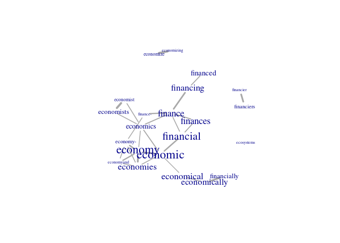
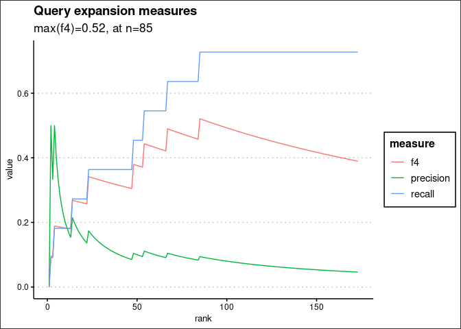
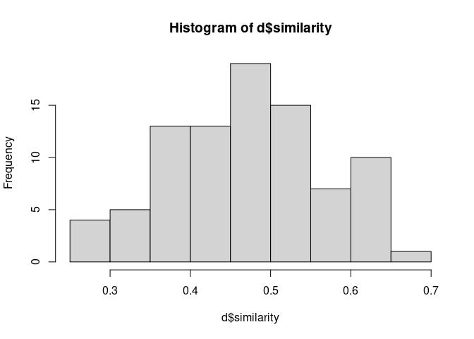
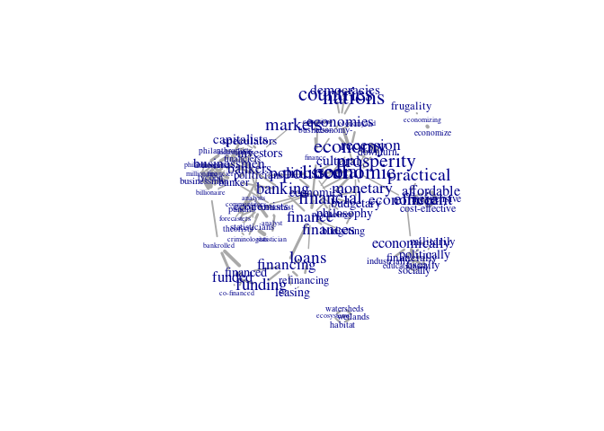

README
================

Lexpander is a set of tools for semi-automatic dictionary expansion
(i.e. using embeddings).

# Instalation

``` r
remotes::install_github("vanatteveldt/lexpander")
```

``` r
library(lexpander)
```

## Getting a FastText embedding model

The package works with embeddings using the FastText format and the
FastTextR package. You can substitute a custom or language-specific
model here, but for this example we will download and use an English
model trained on general Internet data.

You can download the model
[here](https://dl.fbaipublicfiles.com/fasttext/vectors-crawl/cc.en.300.bin.gz)
and unzip it yourself, or you can use the code below:

``` r
if (!file.exists("cc.en.300.bin")) {
  url = "https://dl.fbaipublicfiles.com/fasttext/vectors-crawl/cc.en.300.bin.gz"
  options(timeout=4300)  # assuming 1Mb/s
  download.file(paste0(url), destfile = "cc.en.300.bin.gz")
  # Note: Install R.utils if needed
  R.utils::gunzip("cc.en.300.bin.gz")
}
```

Finally, load the model using the `fastTextR::ft_load` function:

``` r
library(fastTextR)
ft_model = ft_load("cc.en.300.bin")
```

# Dictionary expansion

Using similarity between word embeddings and a seed set of words, we can
automatically expand the dictionary.

For example, suppose we wish to identify passages in the state of the
union speeches that address the economy.

## Wildcard expansion

Let’s start with a very naive ‘dictionary’ for economic news, namely
`eco* OR finan*`. First, we expand the wildcards to get all words
containing these roots:

``` r
words = c("eco*", "finan*")
words = expand_wildcards(ft_model, words)
```

## Compare with distribution in a corpus

The expanded words contains many things that we would not recognize as a
word, e.g. `finances.In`. Since we only care about words that actually
occur

``` r
library(quanteda)
library(tidyverse)
dfm = dfm(tokens(sotu::sotu_text))
words = quanteda.textstats::textstat_frequency(dfm) %>%
  as_tibble() %>% select(word=feature, freq=frequency) %>%
  filter(word %in% words)
words
```

    ## # A tibble: 22 x 2
    ##    word          freq
    ##    <chr>        <dbl>
    ##  1 economic      1225
    ##  2 economy       1014
    ##  3 financial      416
    ##  4 finance        113
    ##  5 finances       102
    ##  6 economical      86
    ##  7 financing       81
    ##  8 economies       76
    ##  9 economically    57
    ## 10 financed        21
    ## # … with 12 more rows

This looks reasonable – the only word that probably doesn’t belong is
`ecosystems`. Note that this was intentional: hopefully, we can
automatically identify such mistakes.

## Internal cohesion of dictionary

``` r
sim = pairwise_similarities(ft_model, words$word)
sim
```

    ## # A tibble: 231 x 3
    ##    word1    word2        similarity
    ##    <chr>    <chr>             <dbl>
    ##  1 economic economy           0.672
    ##  2 economic financial         0.650
    ##  3 economic finance           0.404
    ##  4 economic finances          0.353
    ##  5 economic economical        0.527
    ##  6 economic financing         0.357
    ##  7 economic economies         0.560
    ##  8 economic economically      0.419
    ##  9 economic financed          0.180
    ## 10 economic economics         0.578
    ## # … with 221 more rows

We can plot the data:

``` r
g = similarity_graph(sim, words, threshold = .5)
plot(g)
```

<!-- -->

From this graph, you can directly see that `ecosystems` is an outlier,
and also that `financier*` and `economiz*` form separate components.
This is useful for deciding as a researcher whether to include these
terms or not.

## Automatic expansion using word embeddings

Starting from this seed set of 22 words, we can find words that are
semantically close to the starting words:

``` r
set.seed(1)
results = expand_terms(ft_model, words$word, vocabulary = colnames(dfm))
results
```

    ## # A tibble: 173 x 6
    ##    word        rank in_test precision recall     f4
    ##    <chr>      <int>   <dbl>     <dbl>  <dbl>  <dbl>
    ##  1 bankers        1       0     0     0      0     
    ##  2 economize      2       1     0.5   0.0909 0.0955
    ##  3 banker         3       0     0.333 0.0909 0.0950
    ##  4 economies      4       1     0.5   0.182  0.189 
    ##  5 financier      5       0     0.4   0.182  0.188 
    ##  6 financiers     6       0     0.333 0.182  0.187 
    ##  7 finance        7       0     0.286 0.182  0.186 
    ##  8 financing      8       0     0.25  0.182  0.185 
    ##  9 economy        9       0     0.222 0.182  0.184 
    ## 10 economic      10       0     0.2   0.182  0.183 
    ## # … with 163 more rows

Which we can plot to find an ‘elbow point’:

``` r
results %>% 
  select(rank, precision:f4) %>% 
  pivot_longer(-rank, names_to = "measure") %>% 
  ggplot(aes(x=rank, y=value, color=measure)) + geom_line() +
  ggtitle("Query expansion measures", paste0("max(f4)=", round(max(results$f4),2), ", at n=", which.max(results$f4)))+
  ggthemes::theme_clean()
```

<!-- -->

Which suggests that the ‘sweet spot’ is somewhere around n=85 extra
terms:

``` r
head(results$word, n=85)
```

    ##  [1] "bankers"         "economize"       "banker"          "economies"      
    ##  [5] "financier"       "financiers"      "finance"         "financing"      
    ##  [9] "economy"         "economic"        "industrialists"  "industrialist"  
    ## [13] "businessman"     "economy-"        "political"       "capitalists"    
    ## [17] "businessmen"     "financial"       "billionaire"     "business-"      
    ## [21] "investors"       "philanthropist"  "economyand"      "refinancing"    
    ## [25] "finance-"        "funding"         "recession"       "tycoon"         
    ## [29] "loans"           "banking"         "politics"        "downturn"       
    ## [33] "frugality"       "finances"        "psychology"      "speculators"    
    ## [37] "economics"       "prosperity"      "budgetary"       "budgeting"      
    ## [41] "millionaire"     "cultural"        "monetary"        "philanthropists"
    ## [45] "social"          "politicians"     "education-"      "financed"       
    ## [49] "leasing"         "philosophy"      "job-creation"    "fiscal"         
    ## [53] "speculator"      "economist"       "science"         "crisis-"        
    ## [57] "sociological"    "frugal"          "investor"        "lenders"        
    ## [61] "loan"            "executives"      "saving"          "politics-"      
    ## [65] "entrepreneurs"   "benefactors"     "economists"      "discipline-"    
    ## [69] "environmental"   "technological"   "debts"           "mathematics"    
    ## [73] "contracts-"      "sciences"        "entrepreneur"    "investment"     
    ## [77] "refinance"       "accounting"      "paymasters"      "investments"    
    ## [81] "brokers"         "overspending"    "agricultural"    "social-"        
    ## [85] "economical"

\[*TODO:* Add function for repeating this x times and getting a smoother
result\]

## Exploring the expanded set

``` r
terms = names(nearest_neighbors(ft_model, words$word))
terms = intersect(terms, colnames(dfm)) |> head(85) |> union(words$word)
terms
```

    ##  [1] "funded"          "bankers"         "economists"      "economist"      
    ##  [5] "economize"       "economizing"     "bankrolled"      "banker"         
    ##  [9] "economy"         "economies"       "economically"    "financially"    
    ## [13] "financier"       "financiers"      "fiscally"        "finance"        
    ## [17] "financing"       "economic"        "industrialists"  "industrialist"  
    ## [21] "businessman"     "economy-"        "statisticians"   "political"      
    ## [25] "capitalists"     "businessmen"     "financial"       "industrially"   
    ## [29] "cost-effective"  "politically"     "socially"        "billionaire"    
    ## [33] "educationally"   "business-"       "investors"       "philanthropist" 
    ## [37] "watersheds"      "economyand"      "refinancing"     "statistician"   
    ## [41] "analysts"        "finance-"        "inexpensive"     "funding"        
    ## [45] "militarily"      "recession"       "efficient"       "pundits"        
    ## [49] "tycoon"          "loans"           "forecasters"     "habitat"        
    ## [53] "theorists"       "banking"         "politics"        "criminologists" 
    ## [57] "analyst"         "affordable"      "nations"         "downturn"       
    ## [61] "frugality"       "finances"        "psychology"      "speculators"    
    ## [65] "democracies"     "wetlands"        "economics"       "countries"      
    ## [69] "prosperity"      "budgetary"       "budgeting"       "commentators"   
    ## [73] "millionaire"     "co-financed"     "cultural"        "monetary"       
    ## [77] "philanthropists" "social"          "politicians"     "education-"     
    ## [81] "financed"        "leasing"         "philosophy"      "markets"        
    ## [85] "practical"       "economical"      "ecosystems"

Since we didn’t remove the `ecosystem` word, this also includes terms
related to that, such as habitat. We can check the internal consistency
of the expanded dictionary by looking at distance from centroid vector:

``` r
d = distance_from_centroid(ft_model, terms) |> 
  enframe(name = "word", value="similarity") |>
  arrange(similarity)
d
```

    ## # A tibble: 87 x 2
    ##    word           similarity
    ##    <chr>               <dbl>
    ##  1 habitat             0.254
    ##  2 watersheds          0.269
    ##  3 wetlands            0.283
    ##  4 inexpensive         0.290
    ##  5 affordable          0.323
    ##  6 co-financed         0.331
    ##  7 statistician        0.337
    ##  8 efficient           0.342
    ##  9 militarily          0.344
    ## 10 cost-effective      0.352
    ## # … with 77 more rows

``` r
hist(d$similarity)
```

<!-- -->

We can also create a graph like before

``` r
sim = pairwise_similarities(ft_model, terms)
freqs = quanteda.textstats::textstat_frequency(dfm) %>%
  as_tibble() %>% select(word=feature, freq=frequency) %>%
  filter(word %in% terms)
g = similarity_graph(sim, freqs)
plot(g)
```

<!-- -->

Or interactively with the following code:

``` r
library(networkD3)
sim %>% filter(similarity>.6) %>% simpleNetwork(zoom = T)
```
